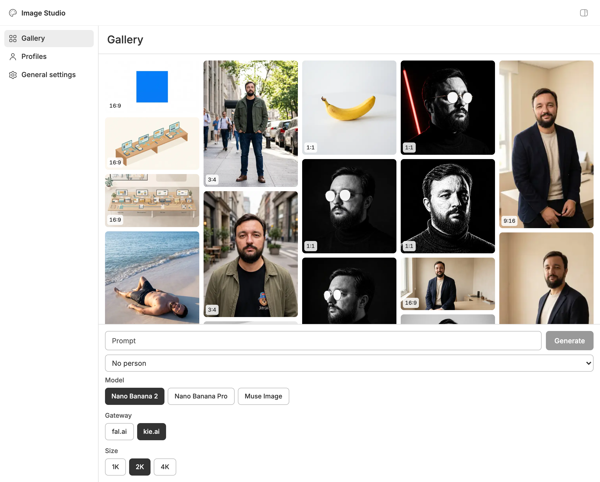
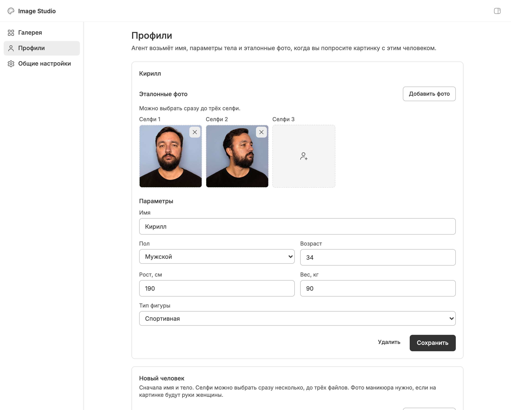
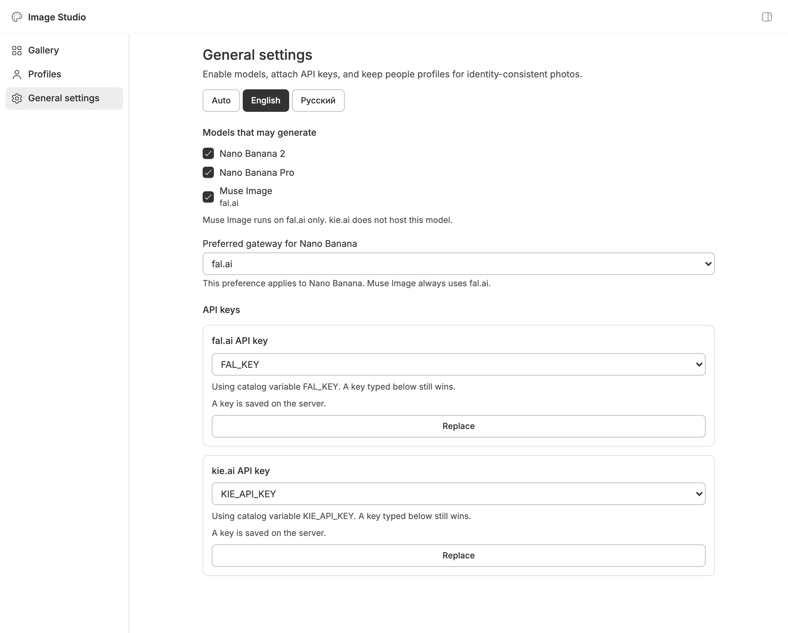

# Image Studio for BB

[](https://getbb.app)
[](LICENSE)

Generate project photos in BB through [fal.ai](https://fal.ai/) and [kie.ai](https://kie.ai/) (Nano Banana 2, Nano Banana Pro, Muse Image), keep them in a gallery, and reuse people profiles with reference photos.

[Русский](README.ru.md) · [Releases](https://github.com/VKirill/bb-plugin-image-studio/releases)



## What it does

- **Gallery** — generated images for the current project, shown in real aspect ratios (not cropped squares). Click a thumbnail to preview. New files are WebP; older PNG files convert on first view.
- **Generate in the panel** — prompt, person profile, model, gateway, and Nano Banana size (default **2K**). Aspect ratio is not a panel filter; the model sets the frame. The gallery labels each photo (1:1, 4:5, 9:16, …).
- **Generate in chat** — ask the agent for a photo. It opens a Send form with the last model, aspect ratio, and size. Change them, then Send. The agent must call `image_studio_generate`, not `bb image-studio generate`.
- **People profiles** — name, body, up to three selfies, optional manicure close-up for shots with hands. Profiles are shared across projects; outputs are per project.



- **Settings** — searchable dropdown to enable models, English or Russian UI, API keys. A key typed in settings overrides Env Catalog. **Muse Image is fal.ai only.** GPT Image 2.5, FLUX.2 Pro, Seedream 5, and Grok Imagine are off until you tick them.



On a phone, Gallery / Profiles / Settings sit in a bottom bar so the prompt field stays usable.

## Install

```sh
bb plugin install https://github.com/VKirill/bb-plugin-image-studio.git --yes
```

Or install **Image Studio** from the BB Community marketplace once the listing is merged.

Then:

1. Open **Image Studio** in the BB sidebar.
2. In **Settings**, open the models list, search if needed, tick the ones you want, and add a fal.ai and/or kie.ai key (or pick one from Env Catalog).
3. Optionally add a person under **Profiles**.
4. Generate from the gallery form, or ask an agent in a project thread for a photo.

## For agents

The bundled skill `image-studio` tells the agent to open the prompt template for the chosen model (Nano Banana, Muse, GPT Image 2.5, FLUX.2, Seedream, or Grok Imagine), then call `image_studio_generate` with the scene (and a profile name if you named a person). Do not pass model, aspect, or size unless the user named them in that turn. Wait until the user presses Send.

CLI (scripts, terminals, and hidden Agency workers; skips the chat picker). Preferred Nano Banana gateway is **kie**. Muse Image always uses **fal**. GPT Image 2.5, FLUX.2, Seedream, and Grok follow the preferred gateway. Pass `--gateway fal` only when you want Banana (or another dual model) on fal.ai.

```sh
bb image-studio generate --prompt "…"
bb image-studio generate --prompt "…" --gateway fal
bb image-studio generate --prompt "…" --model muse-image
bb image-studio generate --prompt "…" --model gpt-image-2.5-flare
bb image-studio profiles
```

A worker that cannot press Send must use this CLI, not `image_studio_generate`. Failures print on stderr (and as the RPC error text). After a failed fal call you should see an HTTP status and JSON from fal.ai, not `[object Object]`. Look at the CLI stderr or `bb plugin rpc call image-studio generate`.

## Requirements

- BB 0.43 or later
- A [fal.ai](https://fal.ai/) and/or [kie.ai](https://kie.ai/) account and API key (those providers bill generation)
- Optional: [Env Catalog](https://github.com/VKirill/bb-plugin-env-catalog) to store keys

## License

MIT
